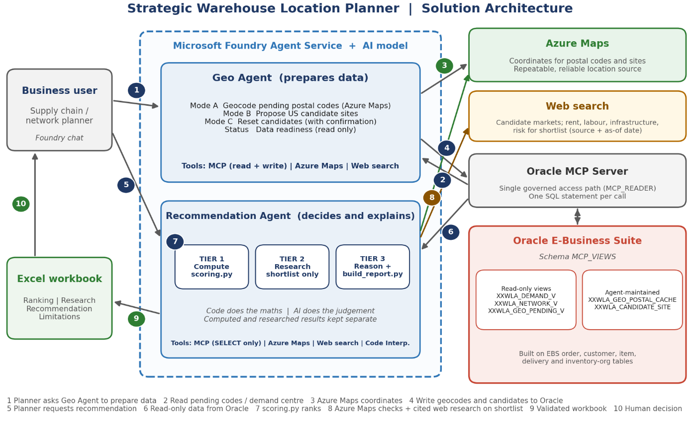

# Strategic Warehouse Location Planner — Powered by AI

Two Microsoft Foundry agents that recommend where to open a new warehouse, from live Oracle E-Business Suite
shipment history on Oracle Exadata Database Service on Oracle Database@Azure. Built for the Oracle AI Database@Azure
Partner Hackathon. The full write-up is [`submission/Strategic_Warehouse_Location_Planner.pdf`](submission/Strategic_Warehouse_Location_Planner.pdf).

**The approach in one line:** the code does the maths, the AI does the judgement, and Oracle stays the system of record.

| Agent | Role |
|---|---|
| `Hackathon-Oracle-Geo-Postal-code-generator` | Prepares the data: geocodes pending postal codes with Azure Maps into `XXWLA_GEO_POSTAL_CACHE` (Mode E, or manual entry in Mode M), reverse-geocodes coordinates (Mode R), builds the candidate site list in `XXWLA_CANDIDATE_SITE` (Modes B, BM, C) and reports data readiness (STATUS). |
| `Hackathon-Oracle-Warehouse-Recommendation-Agent` | Ranks candidate sites against demand (`XXWLA_DEMAND_V`) with a deterministic scoring script, adds cited market research, checks site coordinates with Azure Maps and produces a downloadable report. |

## Architecture



Deployment view:

```
Foundry agent ──mcp──────▶ MCP-relay-app (Azure Function, public, VNet-integrated)
   │                          └──▶ mcp-server-vm (private VNet): nginx ─▶ mcp-proxy ─▶ Oracle SQLcl `sql -mcp`
   │                                                                                     └──▶ Exadata @ Azure (EBS, schema MCP_VIEWS, read-only user)
   ├─openapi (managed identity)──▶ Azure Maps Geocoding API (keyless, Entra ID)
   ├─code_interpreter──▶ attached scripts (scoring.py, build_report.py)
   └─web_search            (Microsoft Web IQ prepared in tools/webiq/, not enabled: limited access)
```

## Test evidence

End-to-end run on 02 Oct 2026, Vision Operations, 01-FEB-2002 to 01-OCT-2010, region ALL
([workbook](submission/evidence/Warehouse_Recommendation_Vision_Operations_20261002_1349.xlsx)):

| Check | Result |
|---|---|
| Oracle control totals | 51 postal codes, 4,796,338 shipped units |
| Geocoded units | 99.9% — ranking status FINAL, no overrides |
| Candidates ranked by `scoring.py` | 100 (82 existing organisations in the overlap test) |
| Recommendation | Columbus OH, computed rank 1, score 0.9894 |
| Azure Maps location check | 3 of 3 shortlisted sites MATCH |
| Market research | 12 findings on 3 sites: 11 cited, 1 ABSENT |

Demo prompts: [`submission/demo-prompts.md`](submission/demo-prompts.md).

## Repository layout

| Path | Contents |
|---|---|
| `agents/<agent>/agent.json` | Agent definition template (model, tools, metadata). `$file` entries point to sibling files; `${NAME}` placeholders are filled from `.env`. |
| `agents/<agent>/instructions.md` | System instructions. |
| `agents/<agent>/files/` | Files attached to Code Interpreter. |
| `tools/openapi/azure_maps.json` | OpenAPI 3 spec for Azure Maps forward (`/geocode`) and reverse (`/reverseGeocode`) geocoding. |
| `tools/ebs-vision-mcp-shim/` | Azure Function that relays MCP over SSE from Foundry to the private MCP backend. |
| `tools/ebs-vision-mcp-backend/` | MCP backend config: systemd unit, startup primer, nginx front, `setup.sh` for a fresh Ubuntu 24.04 VM. |
| `db/mcp_views_xxwla.sql` | DDL for the `XXWLA_*` tables and views the agents read and write, with design comments and the grants for the MCP user. |
| `tools/webiq/` | Microsoft Web IQ OpenAPI spec, prepared as a replacement for `web_search`; not enabled (see its README). |
| `infra/setup.sh` | Keyless Azure Maps account and role assignment. |
| `scripts/` | `export_agent.py`, `deploy_agent.py`, `check_secrets.sh`. |
| `submission/` | Hackathon submission: form text (`SUBMISSION.md`), solution document (`.docx`/`.pdf`), architecture diagram, demo prompts, test evidence. |

## Setup

Prerequisites: Azure CLI logged in (`az login`), Python 3.10+, an Azure AI Foundry project, and an Oracle EBS database reachable from a private VNet.

1. `cp .env.example .env` and fill in the values.
2. **Database:** run `db/mcp_views_xxwla.sql` as the `MCP_VIEWS` owner. It ends with the grants `MCP_READER` needs: `SELECT` on the views, plus write access to the two tables the Geo agent maintains.
3. **MCP backend:** on an Ubuntu 24.04 VM in the private VNet, run `sudo tools/ebs-vision-mcp-backend/setup.sh` and follow its manual steps (DB wallet and saved SQLcl connection `EBSDB_MCP`; credentials are never stored in this repo).
4. **MCP shim:** deploy `tools/ebs-vision-mcp-shim/` to a Python 3.12 Function App (Flex Consumption) with VNet integration into the same VNet, and set the app setting `MCP_BACKEND_URL=http://<vm-private-ip>/sse`. In the Foundry project, add a custom MCP connection named `ebs-vision-mcp` pointing to `https://<function-app>.azurewebsites.net/sse`.
5. **Azure Maps:** `FOUNDRY_ACCOUNT=<foundry-account> MAPS_ACCOUNT=<maps-account> ./infra/setup.sh`, then put the printed client ID in `.env` as `AZURE_MAPS_CLIENT_ID`.
6. **Agents:** check what would be created, then deploy:
   ```
   python scripts/deploy_agent.py geo-postal-code --dry-run
   python scripts/deploy_agent.py geo-postal-code
   python scripts/deploy_agent.py warehouse-recommendation
   ```
   Each deploy uploads the Code Interpreter files and creates a new agent version; earlier versions stay available for rollback.

## Updating the repo from Foundry

Agents are edited in the Foundry portal, so the repo is refreshed by exporting:

```
python scripts/export_agent.py            # all agents, latest versions
python scripts/deploy_agent.py warehouse-recommendation --dry-run   # expect: IDENTICAL to live vN
./scripts/check_secrets.sh                # must print "secret scan: clean" before committing
```

`agent.json` records `exported_from_version` so every commit names the Foundry version it came from.

## Security notes

- No keys anywhere. Azure Maps is called with Entra ID: the OpenAPI tool uses `managed_identity` auth (audience `https://atlas.microsoft.com/`), and the token comes from the **Foundry account's** system-assigned identity, which holds `Azure Maps Data Reader`. `x-ms-client-id` (the Maps account ID) is a public identifier, not a secret.
- The MCP shim's `/sse` and `/messages/` routes are anonymous because Foundry's MCP client drops function keys; the security boundary is VNet isolation of the backend and the `MCP_READER` database user, which is limited to `MCP_VIEWS` and read-only except for the two agent-maintained `XXWLA_*` tables.
- The backend's authenticated nginx listeners (`:8080`, `:8443`) use a bearer token generated on the VM by `setup.sh` (`/mcp/config/bearer.secret`); the repo holds only the `${MCP_BACKEND_BEARER_TOKEN}` placeholder.
- The nginx config in this repo omits a debug access-log format used during development on the live VM.
- `.env` is gitignored; `scripts/check_secrets.sh` fails if any `.env` value or secret-like string appears in tracked files.

## Data

`agents/geo-postal-code/files/2025_Gaz_zcta_national Clean txt.txt` is derived from the US Census Bureau 2025 Gazetteer ZCTA file (public domain). It and `gaz_load.py` are still attached to the Geo agent's Code Interpreter but are no longer used by its instructions, which take coordinates from Azure Maps only.

The test evidence workbook uses Oracle's Vision demo data.
